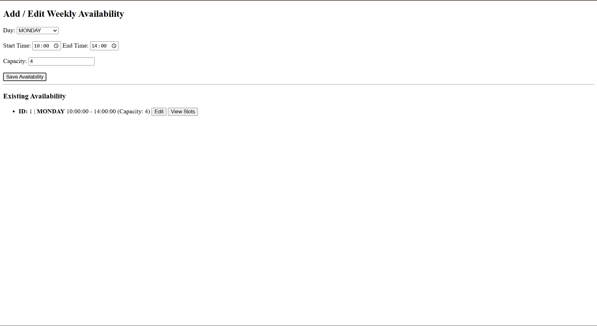

# 🗓️ Interview Scheduling System

A **full-stack Interview Slot Scheduling System** built using **Java Spring Boot**, **MySQL**, and **Node.js (Express + EJS)**.  
This system allows interviewers to define weekly availability and enables candidates to book interview slots safely with full data integrity.

---

## 👤 Author

**Siddharrtha Shankar**  
GitHub: https://github.com/SIDDHARRTHA

---

## 📌 Project Overview

This application addresses real-world interview scheduling challenges by providing a reliable and scalable booking workflow.

### Core Capabilities
- Define weekly interview availability
- Auto-generate 30-minute interview slots for the next 14 days
- Allow candidates to book exactly one slot
- Prevent overbooking and duplicate bookings
- Regenerate slots safely after availability updates

---

## 🖼️ Application Screenshots

### 🏠 Main Dashboard


### ✏️ Availability After Edit


### 🗓️ Interview Slots View


---

## 🏗️ System Architecture

Frontend (Node.js + Express + EJS)
|
| REST APIs
v
Backend (Spring Boot)
|
v
MySQL Database

yaml
Copy code

---

## 🛠️ Tech Stack

### Backend
- Java 17
- Spring Boot 3.x
- Spring Data JPA (Hibernate)
- MySQL
- Maven

### Frontend
- Node.js
- Express.js
- EJS (Server-side Rendering)
- Axios / Fetch API

### Database
- MySQL
- InnoDB (Foreign Keys + Transactions)

---

## ✨ Key Features

### Availability Management
- Create and update weekly availability
- Validate start and end times
- Prevent invalid or overlapping schedules

### Slot Generation
- Generate slots for the next two weeks
- Fixed 30-minute duration
- Safe cleanup and regeneration logic

### Slot Booking
- One booking per candidate email
- Slot capacity enforcement
- Transaction-safe booking process

### Error Handling
- Slot full exception handling
- Duplicate booking prevention
- Meaningful HTTP status codes

---

## 📂 Project Structure

interview-scheduling/
│
├── backend/
│ ├── src/main/java/com/app/interview/
│ │ ├── controller/
│ │ ├── service/
│ │ ├── model/
│ │ ├── repository/
│ │ ├── exception/
│ │ └── config/
│ └── src/main/resources/
│
├── frontend/
│ ├── app.js
│ ├── package.json
│ └── views/
│ ├── availability.ejs
│ └── slots.ejs
│
├── database/
│ └── schema.sql
│
├── assets/
│ ├── main.png
│ ├── afteredit.png
│ └── slots.png
│
├── README.md
└── .gitignore

yaml
Copy code

---

## 🧠 API Endpoints

### Availability
| Method | Endpoint | Description |
|------|---------|-------------|
| GET | `/api/availability` | Fetch all availability |
| POST | `/api/availability` | Add availability |
| PUT | `/api/availability/{id}` | Update availability |

### Slots
| Method | Endpoint | Description |
|------|---------|-------------|
| GET | `/api/slots/by-availability/{id}` | Fetch slots |

### Booking
| Method | Endpoint | Description |
|------|---------|-------------|
| POST | `/api/book/{slotId}?email=` | Book interview slot |

---

## 🗄️ Database Design

### weekly_availability
- id
- day_of_week
- start_time
- end_time
- capacity

### interview_slot
- id
- start_time
- end_time
- capacity
- booked
- availability_id (FK)

### booking
- id
- candidate_email (UNIQUE)
- slot_id (FK)

---

## 🚀 How to Run the Project

### Database Setup
```sql
CREATE DATABASE interview_db;
Run:

pgsql
Copy code
database/schema.sql
Backend Setup
bash
Copy code
cd backend
mvn clean install
mvn spring-boot:run
Backend URL:

arduino
Copy code
http://localhost:8080
Frontend Setup
bash
Copy code
cd frontend
npm install
npm start
Frontend URL:

arduino
Copy code
http://localhost:3000
🧪 Testing Flow
Open frontend application

Add weekly availability

View generated interview slots

Book a slot using email

Attempt duplicate booking (blocked)

Attempt booking a full slot (blocked)

🔐 Data Integrity & Safety
Foreign key constraints enforced

Transactional slot booking

Safe slot regeneration

Backend-level validation

📝 Future Enhancements
Delete availability

Maximum interviews per week

Admin authentication

Slot pagination

Docker support

📜 License
This project is created for educational and interview evaluation purposes.

⭐ Final Notes
This project demonstrates:

Clean REST API design

Robust database schema

Race condition handling

Real-world scheduling logic

End-to-end full-stack integration
